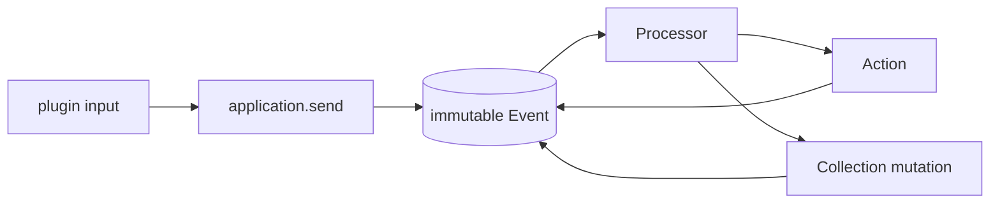

# Copilotz

Copilotz 0.62 is a plugin-first, event-sourced runtime for durable AI
applications. The runtime owns generic mechanics; plugins own business meaning.



Plugins contribute five primitives:

- Collections: durable semantic state and relations.
- Actions: executable capabilities with one durable lifecycle.
- Processors: event-driven orchestration.
- Resources: declarative agents, models, tools, skills, and policy.
- Adapters: application-owned external implementations and credentials.

Messages, agents, models, tools, goals, and channels belong to their semantic
plugins. The generic runtime contains no provider catalog, Tool executor,
conversation DTO, or hidden workflow controller.

## Install

```ts
import { createCopilotz } from "jsr:@copilotz/copilotz@^0.62.0";
```

Host-only capabilities live on explicit subpaths. Importing the root does not
pull in filesystem, subprocess, terminal, MCP stdio, or provider credentials.

## Compose an AI application

```ts
import { createCopilotz } from "jsr:@copilotz/copilotz@^0.62.0";
import { corePlugin, message } from "jsr:@copilotz/copilotz@^0.62.0/core";
import type { LlmAdapter } from "jsr:@copilotz/copilotz@^0.62.0/llm";

declare const myLlmAdapter: LlmAdapter;

const app = await createCopilotz({
  namespace: "acme",
  database: { url: ":memory:" },
  plugins: [corePlugin],
  resources: {
    agents: {
      support: {
        id: "support",
        name: "Support",
        role: "Answer clearly and use only explicitly granted capabilities.",
        models: { generate: "default" },
        capabilities: {},
      },
    },
    models: {
      default: { adapter: "default", model: "provider-model-id" },
    },
  },
  adapters: { llm: { default: myLlmAdapter } },
});

// A Channel, Goal, onboarding plugin, or trusted Gateway route has already
// created this thread and its human/agent participants.
const operation = await app.send(message({
  thread: "thread-1",
  participant: "user-1",
  recipientIds: ["agent-support"],
  content: "How can you help me?",
}));

for await (const output of operation.outputs) {
  console.log(output.type, output.correlationId);
}
await operation.done;
await app.close();
```

`send()` accepts one plugin-owned input envelope. It returns the durable ingress
Event identity, a request-bound output stream, a settlement Promise, and
cancellation. `observe()` creates an independent application-wide subscription.
The public application surface is exactly `{ send, observe, close }`; Gateway
adds `fetch`, while Worker returns `{ ready, closed, close }`.

## Core guarantees

- Collection state, Event Bodies, immutable Events, and required delivery
  obligations commit atomically.
- Durable Processor execution is at least once. Stable mutation operation keys
  and Action identities make retries restore the same result.
- Action lifecycle data is self-contained and authenticated by runtime-created
  Event Bodies. Public input cannot forge a registered lifecycle receipt.
- Model Resources contain only durable configuration. LLM Adapters capture
  credentials, clients, endpoints, and runtime transport.
- Tool Resources are data-only presentations of the same Action aliases that
  Core invokes. There is no second Tool execution path.
- Progressive `stream.output` observations contain generic content metadata and
  one subscriber-owned byte follower. Semantic routing stays in plugins.
- Normal provisioning creates only a fresh v4 schema or validates an existing v4
  schema. Legacy databases require the explicit migration.

## Public package map

| Area               | Subpaths                                                                                                                              |
| ------------------ | ------------------------------------------------------------------------------------------------------------------------------------- |
| Application        | root factory; `/application` types                                                                                                    |
| Generic primitives | `/actions`, `/collections`, `/content`, `/streams`, `/events`, `/plugins`, `/persistence`, `/tokens`                                  |
| AI harness         | `/core`, `/llm`, `/tools`, `/skills`, `/knowledge`, `/memory`, `/goals`, `/usage`                                                     |
| Integrations       | `/channels`, `/schedules`, `/schedules/core`, `/admin`, `/server`                                                                     |
| Host capabilities  | `/adapters/deno`, `/core/cli`, `/core/cli/node`, `/skills/deno`, `/tools/deno`, `/tools/mcp/stdio`, `/tools/persistent-terminal/deno` |
| Tool factories     | `/tools/builtin`, `/tools/finance`, `/tools/mcp`, `/tools/openapi`, `/tools/persistent-terminal`, `/tools/web`                        |
| Database upgrade   | `/migration/v4`                                                                                                                       |

The authoritative export list is `deno.json`. There are no `/domain`,
`/attachments`, generic `/adapters`, `/adapters/node`, or legacy migration
subpaths.

## Documentation

- [Quickstart](docs/quickstart.md)
- [Architecture](docs/architecture.md)
- [API and package reference](docs/api.md)
- [Plugins and processors](docs/plugins-and-processors.md)
- [Events, deliveries, and recovery](docs/events-deliveries-recovery.md)
- [Content and assets](docs/content-assets.md)
- [Progressive streams](docs/streams.md)
- [Embedding, Gateway, and Worker roles](docs/embedding-and-hypervisors.md)
- [Legacy 0.47/0.48 to v4 migration](docs/migration-v4.md)

The first-principles contract is [ARCHITECTURE.md](ARCHITECTURE.md).

## Verification

```sh
deno task check
deno task test
deno publish --dry-run --allow-dirty
```

## License

MIT
