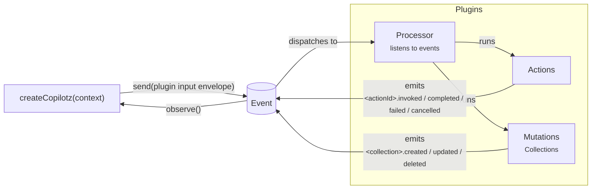

# Copilotz

Copilotz v3 is an event-native runtime for durable, plugin-composed agent
applications.

Runtime owns the event backbone. Plugins own business meaning. The core loop is:



Essential boundaries:

- `copilotz.send(...)` is runtime-neutral ingress; it does not invoke a plugin
  Action directly.
- Processors listen to Events and invoke plugin-owned Actions or Collections.
- Actions emit `<actionId>.invoked/completed/...`.
- Collections are semantic graph state and emit
  `<collection>.created/updated/...`.
- Action events carry self-contained input and output Event Bodies; Processors
  receive the resolved body as `event.data`.
- Messages remain the canonical semantic conversation history. LLM attempts and
  tool executions are operational Actions rather than graph Collections.

## Install

```ts
import { createCopilotz } from "jsr:@copilotz/copilotz@^0.61.0";
import { core } from "jsr:@copilotz/copilotz@^0.61.0/core";
```

The root package is runtime-neutral. Host capabilities such as MCP stdio,
filesystem access, subprocesses, CLI terminal I/O, and HTTP mounting live on
explicit package subpaths.

## Minimal application shape

```ts
import { createCopilotz } from "jsr:@copilotz/copilotz@^0.61.0";
import { core } from "jsr:@copilotz/copilotz@^0.61.0/core";

const copilotz = await createCopilotz({
  namespace: "example",
  database: { url: ":memory:" },
  context: {
    llm: {
      default: myLlmAdapter,
    },
    agents: {
      support: {
        id: "support",
        name: "Support",
        role: "Helpful support agent",
        capabilities: {},
      },
    },
  },
});

const sent = await copilotz.send(core.message({
  thread: "thread-1",
  participant: "user-1",
  recipientIds: ["agent-support"],
  content: "Hello",
}));

for await (const event of copilotz.observe()) {
  console.log(event.type, event.correlationId);
  if (event.correlationId === sent.correlationId) break;
}
await sent.done;
await copilotz.close();
```

`send()` accepts one plugin-owned input envelope. Helpers such as
`core.message(...)` are exported by their owning plugin; the runtime persists
the envelope opaquely and processors decide what it means. `observe()` is the
application observation stream. Durable event persistence, replay, delivery, and
deduplication remain runtime infrastructure rather than a second public workflow
API.

## Core guarantees

- Public runtime products are frozen records created by factories; architecture
  services are not classes.
- Every durable domain mutation atomically commits graph state, one immutable
  event, and the sparse delivery rows required by matched processors.
- Delivery is at-least-once. Built-in mutations deduplicate by delivery-derived
  operation keys, and tools receive an idempotency key.
- Raw token/audio/future media frames are ephemeral Web Streams. Final
  transcripts, messages, tools, errors, and stream lifecycle facts are durable.
- Plugins compose in deterministic order: core, declared plugins, then explicit
  application context. Later context values replace earlier values by namespace
  and key.
- Installed resources do not create ambient agent authority. Exact
  `capabilities` grants are required; broad access uses explicit
  `{ all: true }`.
- Injected Ominipg databases, Oxian Hypervisors, and dispatchers remain owned by
  the embedding application.
- Copilotz-owned database configurations and connection capabilities recover
  through one shared physical-connection generation; indeterminate operations
  are never replayed, active attachments terminate, and durable deliveries
  resume after reconnect.
- Logical `namespace` and physical `databaseSchema` scope are explicit; one
  application can lazily bind multiple schemas without creating another database
  connection or Oxian runtime.

## Package map

| Subpath                            | Purpose                                                                |
| ---------------------------------- | ---------------------------------------------------------------------- |
| `@copilotz/copilotz`               | Normal runtime-neutral application API                                 |
| `/application`                     | Embedded, Gateway, and Worker role factories                           |
| `/core`                            | Minimal semantic AI harness plugin                                     |
| `/plugins`                         | Plugin definition and composition primitives                           |
| `/events`                          | Immutable events and durable delivery contracts                        |
| `/content`, `/domain`              | Canonical assets and graph-native repositories                         |
| `/attachments`                     | Persistent text/realtime ingress                                       |
| `/llm`, `/tools`                   | LLM and Tool plugin contracts and integrations                         |
| `/tools/*`                         | Optional Tool plugins, protocol integrations, and host implementations |
| `/skills`                          | Optional Open Skill resources and portable disclosure tools            |
| `/skills/deno`                     | Deno build-time Open Skill packer                                      |
| `/knowledge`                       | Optional Knowledge plugin primitives                                   |
| `/memory`, `/goals`, `/usage`      | Optional semantic state and workflow plugins                           |
| `/schedules`, `/schedules/core`    | Generic scheduling and optional Core-message integration               |
| `/channels`, `/actions`, `/admin`  | Transport plugins, executable primitives, and admin APIs               |
| `/adapters`                        | Ominipg adaptation and portable CLI mechanics                          |
| `/adapters/deno`, `/adapters/node` | Generic host/runtime adapters                                          |
| `/server`                          | Event-native server projection types                                   |
| `/migration/v1`                    | Isolated one-way database upgrade; never imported by normal runtime    |

## Documentation

Start with [the v3 quickstart](docs/quickstart.md), then read:

- [Architecture](docs/architecture.md)
- [Plugins and processors](docs/plugins-and-processors.md)
- [Agent capabilities](docs/agent-capabilities.md)
- [Skills](docs/skills.md)
- [Events, deliveries, and recovery](docs/events-deliveries-recovery.md)
- [Content and assets](docs/content-assets.md)
- [Embedding and hypervisors](docs/embedding-and-hypervisors.md)
- [Multi-agent public ask](docs/multi-agent-ask.md)
- [Realtime attachments](docs/realtime-attachments.md)
- [API and package reference](docs/api.md)
- [Migrating from v0.x](docs/migration-v3.md)
- [v3 release notes](CHANGELOG.md)

The detailed implementation contracts and parity evidence live in
[docs/v3](docs/v3/README.md).

## Validation

```sh
deno task check
deno task test
deno task bundle:runtime-smoke
deno task smoke:deno
deno task smoke:node
deno task smoke:bun
deno task smoke:browser
deno task bundle:edge-smoke
deno task smoke:cloudflare
deno task smoke:cloudflare-build
deno task publish:dry-run
```

CI additionally runs the PostgreSQL migration/event matrix before publishing.

## License

MIT
