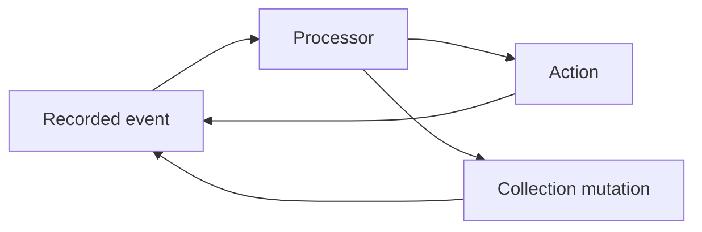

# Copilotz

**We believe in a future where every application will have an embedded agent or
team of agents.**

**Copilotz is a full-stack TypeScript framework for building these
applications.** Build your application’s data, actions and workflows on a shared
event runtime, connect your interfaces through server and client APIs, and give
agents the tools to operate it—individually or together.

[Get started](#quick-start) · [Explore the framework](#why-copilotz) ·
[Documentation](#documentation) · [JSR](https://jsr.io/@copilotz/copilotz)

## Building an agent is only the beginning

The first model call is usually the easy part. Then the agent needs to use your
application’s data, call an API, remember useful information, work with another
agent, or respond through a different channel. Your product needs its own
workflows and interfaces. When something goes wrong, you need to understand
which operations ran and what they changed.

Each capability brings application work with it: state, execution, integrations,
storage and a way to inspect what happened. Across projects, much of that work
repeats.

Copilotz brings these pieces together. Its event-sourced runtime handles
execution and state changes. Reusable plugins define application behavior,
including the supplied agent harness. You can build a new application on that
foundation or embed the capabilities you need in an existing product.

## What’s included

| When you need…                  | Copilotz provides…                                                                                           |
| ------------------------------- | ------------------------------------------------------------------------------------------------------------ |
| Agents that can act             | Declarative agents, model connections, explicit capabilities and native tools                                |
| Your existing APIs as tools     | OpenAPI generation and MCP integration                                                                       |
| Reusable agent instructions     | Skills with metadata up front and instructions loaded on demand                                              |
| Application data and behavior   | Collections, Actions and event-driven Processors                                                             |
| Agent collaboration             | Directed conversations between people and agents, with recorded questions and answers between agents         |
| Memory and knowledge            | Optional semantic memory and document ingestion, embeddings and retrieval plugins                            |
| An execution history            | Recorded events, **Action and Collection lifecycles**, and causation/correlation links                       |
| Interfaces and channels         | Server and browser client APIs; web, WhatsApp, Telegram, Discord and Zendesk channel plugins                 |
| Persistence and content storage | PostgreSQL or PGlite, with large content stored through configurable BodyStores                              |
| Usage accounting                | Optional usage records and cost-resolution hooks                                                             |
| A deployment topology           | **In-process execution or Gateway + Worker roles**, connected through transports such as WebSockets over WSS |

These capabilities are composed through plugins and application configuration.
Start with what your application needs and add more as it grows.

## Quick start

### Install

With Deno:

```sh
# Add the package and its plugin subpaths to your Deno project.
deno add jsr:@copilotz/copilotz@^0.85.0
```

Deno 2.9 delays freshly published dependencies for 24 hours. To try a new
Copilotz release immediately, follow the package-specific exception in the
[guide’s Deno setup](docs/getting-started.md#deno).

With Node 24+:

```sh
# Install Copilotz and configure its imports for Node.
npx jsr add @copilotz/copilotz@^0.85.0
# Node needs the PGlite package for the default in-memory database.
npm i @electric-sql/pglite
# Use ESM so Node 24+ can execute the TypeScript example directly.
npm pkg set type=module
```

### Say hello

Save this as `assistant.ts`. Define an assistant, send it a message and print
its reply. Set `OPENAI_API_KEY` in your environment before running it.

```ts
// Runtime APIs come from the package root; the supplied harness owns /core.
import { createCopilotz, isStreamOutput } from "@copilotz/copilotz";
// Read a provider credential supplied by the host environment.
import { env } from "node:process";
import { corePlugin, message } from "@copilotz/copilotz/core";

// Compose one application. Its default database is in memory.
const app = await createCopilotz({
  namespace: "demo", // Scope this application's data and execution records.
  plugins: [corePlugin], // Install the conversation harness and its LLM dependency.
  // Resources configure the installed plugins without changing their code.
  resources: {
    llmConnections: {
      // "openai" is the connection alias referenced by the assistant below.
      openai: {
        provider: "openai", // Select the provider implementation.
        auth: { apiKey: env.OPENAI_API_KEY! }, // Supply its runtime credential.
      },
    },
    agents: {
      // "assistant" is the resource alias used to address this agent.
      assistant: {
        id: "assistant", // Stable agent identity in recorded conversations.
        name: "Assistant", // Display name.
        role: "A helpful assistant.", // Tell the model what this agent does.
        // Ordered choices for ordinary text generation.
        models: { generate: [{ connection: "openai", model: "gpt-5.4-mini" }] },
      },
    },
  },
});

try {
  // Core turns this typed input into conversation state and model work.
  const turn = await app.send(message({
    thread: { externalId: "hello" }, // Create or reuse this conversation.
    participant: { externalId: "you", participantType: "human" }, // The sender.
    recipientIds: ["assistant"], // Enroll and address the configured agent.
    content: "Say hello!", // Plain text is valid message content.
  }));

  // Print content streams; other outputs carry execution information.
  for await (const output of turn.outputs) {
    if (isStreamOutput(output) && output.role === "content") {
      console.log(await new Response(output.payload).text());
    }
  }
  await turn.done; // Wait for the complete turn, including tool work, to settle.
} finally {
  await app.close(); // Release workers, streams and the owned database.
}
```

Run it with either host:

```sh
# Run the example with Deno; its permissions cover the provider and local runtime.
deno run -A assistant.ts
# Or execute the same file with Node 24+.
node assistant.ts
```

You should see a greeting from the assistant. Change `role` to give it a
different purpose and `content` to ask it something else. Copilotz creates the
conversation and its participants on the first message.

Import runtime primitives from `@copilotz/copilotz`; import each plugin's
definitions and helpers from its own entrypoint, such as
`@copilotz/copilotz/core`.

The example uses an in-memory database. To keep records and execution history
across restarts, add this option to `createCopilotz()`:

```ts
// Pass this value as the database option in the createCopilotz() call above.
const database = {
  url: "file://./data", // Keep PGlite state in a local directory across restarts.
};
```

Or use a PostgreSQL connection URL. The
[Getting started guide](docs/getting-started.md) grows this assistant one
chapter at a time, adding tools, application data, workflows and the optional
capabilities your product needs.

## Why Copilotz?

The sections below show focused declarations and configuration excerpts. The
Quick start above is the complete runnable example.

### Define agents by their purpose and capabilities

Give an agent a role, choose its models, and declare what it may use. An
assistant can have a small tool set; a specialist can have different tools,
skills and teammates.

Model choices are ordered, so an agent can fall back to another connection or
model. Connections hold provider authentication and transport configuration
separately from the agent definition.

```ts
// Register this resource under resources.agents.researcher in your application.
const researcher = {
  id: "researcher", // Stable identity, independent of the resource map alias.
  name: "Researcher", // Name shown to people and peer agents.
  role: "Research questions and save useful notes.", // Purpose sent to the model.
  models: {
    // Reference a configured connection and a model available to that account.
    generate: [{ connection: "openai", model: "gpt-5.4-mini" }],
  },
  // These aliases must be registered; installation alone does not grant access.
  capabilities: {
    tools: ["clock", "saveNote"], // Executable operations the agent may select.
    agents: ["reviewer"], // Agent it may ask once both are thread participants.
    skills: ["research"], // Instructions the agent may discover and load.
  },
};
```

Register the named connections and capabilities in the application. Adding a
plugin makes its capabilities available for composition; each agent still
receives an explicit grant. An omitted grant means none.

See [Agent capabilities](docs/agent-capabilities.md) and
[LLM connections](plugins/llm/resources/connection/README.md).

### Build application functionality once, then let agents use it

An application needs durable records and operations whether a person, an
integration or an agent initiates the work. Copilotz gives those operations a
shared implementation and execution history.

Here is a reusable plugin that stores notes and exposes a save operation as an
agent tool:

```ts
// Application state and behavior use the same runtime authoring API.
import {
  type ActionContext,
  defineAction,
  defineCollection,
  definePlugin,
} from "@copilotz/copilotz";
import { defineTool } from "@copilotz/copilotz/core";

// Describe application records independently of any agent.
const note = defineCollection({
  name: "note", // Collection name and prefix of its lifecycle events.
  // JSON Schema validates records written to this Collection.
  schema: {
    type: "object", // Each note is a record.
    properties: {
      id: { type: "string", readOnly: true }, // Runtime-assigned record identity.
      text: { type: "string" }, // The note's application data.
    },
    required: ["text"], // Reject records without note text.
  } as const,
});

// Implement one operation that people, integrations and agents can share.
const saveNote = defineAction({
  id: "notes.save", // Stable operation identity and lifecycle-event prefix.
  // Validate callers before the implementation executes.
  inputSchema: {
    type: "object", // Accept a named input record.
    properties: { text: { type: "string", minLength: 1 } }, // Nonempty text.
    required: ["text"], // Every invocation must supply the text.
    additionalProperties: false, // Catch unexpected input fields.
  } as const,
  // Context provides the Collections bound by the final plugin composition.
  execute(input: Readonly<{ text: string }>, context: ActionContext) {
    return context.collections.note.create(
      { text: input.text }, // Store the validated application value.
      { operationKey: "save-note" }, // Reuse this write within an Action replay.
    );
  },
});

// Package the capability once and reuse it in different applications.
export const notesPlugin = definePlugin({
  id: "@example/notes", // Identity of this reusable plugin.
  version: "1.0.0", // Version of your plugin, separate from Copilotz's version.
  collections: { note }, // Bind context.collections.note.
  actions: { saveNote }, // Bind context.actions.saveNote and expose its lifecycle.
  resources: {
    tools: {
      // Present that same Action to Core; tool and Action aliases must match.
      saveNote: defineTool("saveNote", saveNote, {
        name: "Save note", // Model-facing label.
        description: "Save a note for later reference.", // When to call it.
      }),
    },
  },
});
```

Compose `notesPlugin` into the application and add `saveNote` to the assistant’s
tool grants. The same Action can also be exposed through the server API. Your
application decides who may invoke it and which data they may access.

Collections support schemas, indexes, relations, named queries and mutation
commands. Processors react to recorded events to continue a workflow or perform
background work. Package related functionality into a plugin and reuse it across
applications, with each application supplying its own configuration and
Adapters.

See [Plugins and Processors](docs/plugins-and-processors.md),
[server APIs](docs/server.md) and
[plugin authoring](docs/convention-authoring.md).

### Connect tools without rebuilding every integration

Your product may already expose an API. Other services may publish an OpenAPI
specification or an MCP server. Copilotz can turn those declarations into
Actions and tool presentations that agents can use.

| Source                   | How it becomes a capability                                            |
| ------------------------ | ---------------------------------------------------------------------- |
| Your code                | Define a tool directly, or give an existing Action a tool presentation |
| An OpenAPI specification | Declare `defineApi({schema,...})` in `resources.apis`                  |
| An MCP server            | Declare `await defineMcp({...})` in `resources.mcp`                    |
| Supplied tool libraries  | Import the native declarations or plugins you need                     |

Generated tools use the same Action lifecycle as your own tools. Authentication,
request customization and runtime connections remain configurable through
application Adapters.

Supplied tool libraries cover capabilities such as the clock, content access,
web search, page fetching, finance, filesystem operations and terminal sessions.
Host capabilities live on explicit subpaths, so applications choose the
implementations appropriate to their environment.

See [OpenAPI tools](plugins/tool-openapi/README.md),
[MCP tools](plugins/tool-mcp/README.md) and the
[package reference](docs/api.md).

### Let agents talk directly

Some work benefits from another perspective or a different specialization.
Copilotz models conversations with participants and directed messages, so people
and agents can address one another in the same room.

An agent’s teammate grants determine whom it may consult:

```ts
// Assign this value to an agent's capabilities property.
const capabilities = {
  agents: ["reviewer"], // Exact registered alias of a teammate it may consult.
};
```

Register `reviewer` as another Agent Resource and include the relevant
participants in the conversation. Core supplies the `ask` capability from the
teammate grant. Core records the question and answer as public messages in the
conversation.

Each agent can have its own role, model choices, tools and skills. This supports
an individual assistant, a group of specialists, or conversations involving
several people and agents.

[Agent collaboration](docs/getting-started/part-2-capabilities/09-agent-collaboration.md)
adds a second agent and shows how participant membership enables consultation.
[Agent capabilities](docs/agent-capabilities.md) explains the grants.

### Give agents context that lasts beyond the next prompt

Conversation history, long-term memory and a document knowledge base serve
different purposes. Copilotz provides separate plugins for these capabilities.

- **Semantic memory** consolidates conversation evidence and continuity into
  durable records. Records can preserve sources, relationships, corrections and
  outstanding work.
- **Knowledge** handles document ingestion, chunking, embeddings and retrieval,
  with application-selected loaders, extractors and embedding implementations.
- **Skills** package instructions and supporting material. Agents see granted
  skill metadata and load the detailed instructions when needed.

You choose the plugins, their configuration and each agent’s grants. Memory
consolidation uses the owning agent’s model. Configure embeddings for vector
retrieval and grant each agent the memory, knowledge and skill capabilities it
needs.

See [Memory](docs/memory.md), [Knowledge](plugins/knowledge/README.md) and
[Skills](docs/skills.md).

### Understand what happened—and what changed

When an agent reports a result, you need to inspect the work behind it. The same
applies to a webhook, a background workflow or an operation started by a person.

Copilotz records Action lifecycles and Collection mutations as immutable events.
For the note-saving Action above, the history includes facts such as:

```text
# The Action begins, changes application state, then reports its result.
notes.save.invoked   # Recorded Action invocation.
note.created        # Recorded Collection mutation.
notes.save.completed # Recorded Action completion.
```

Action events show invocation, progress, completion, failure and cancellation.
Collection events show record creation, updates, deletion and named commands.
Causation and correlation links help connect related work.

That history helps you trace a model call, a tool invocation and the resulting
application changes through the same execution model. Persistent storage keeps
the facts available after the process ends.

Processors receive durable deliveries **at least once**. Stable operation keys
and Action identities let retries restore settled results; external side effects
still require idempotency handling at the service that owns them.

See [Events, Deliveries, and Recovery](docs/events-deliveries-recovery.md).

### Connect the application to its users

The server plugin exposes Actions, Collections, content and operations through a
Fetch-based API. The browser client provides typed calls and stream handling.
Your own interfaces can use those APIs alongside an agent interface.

With `serverPlugin` composed and its access policy configured, a Deno host can
serve the application’s handler:

```ts
// app.fetch is supplied by the configured Server plugin composition.
// This listener binds that standard Fetch handler to a Deno HTTP port.
Deno.serve({ port: 3000 }, app.fetch);
```

Node hosts can use a Fetch-compatible server adapter. Separate optional
`@copilotz/chat-adapter` and `@copilotz/chat-ui` packages provide a React chat
interface.

Channels connect conversations to web, WhatsApp, Telegram, Discord and Zendesk
through platform-specific ingress and egress adapters. You configure the
channel, credentials and routing while reusing your agent definitions.

See [HTTP server and browser client](docs/server.md),
[Channels](docs/channels.md) and the
[interfaces and channels](docs/getting-started/part-3-production/12-interfaces-and-channels.md).

### Keep content and operating data manageable

Large text, JSON and binary bodies can live outside application records.
Copilotz keeps content references in durable state and resolves the bodies when
they are needed. BodyStores can use database storage, local files, S3-compatible
storage or native Google Cloud Storage.

The optional Usage plugin records metered work and exposes aggregate analytics
and attempt details. Application hooks can resolve costs using the pricing
source appropriate to the deployment.

See [Content and assets](docs/content-assets.md),
[BodyStores](docs/content-assets.md#body-storage) and
[Usage](plugins/usage/README.md).

### Choose where execution runs

Start with `createCopilotz()` embedded in your application process. When you
want execution elsewhere, the same factory supports Gateway and Worker roles.

| Topology           | Application shape                                                                                           |
| ------------------ | ----------------------------------------------------------------------------------------------------------- |
| Embedded           | Gateway and Worker execution within one process                                                             |
| Split roles        | An explicit Gateway and Worker connected through an in-process transport                                    |
| Separate processes | Gateways and Workers communicating through configured WebSocket connections, using WSS for secure transport |

Each process loads its plugin implementations and connections locally. Keep the
application composition equivalent across roles and use a shared persistence
backend for separate processes.

See [Embedding, Gateways, and Workers](docs/embedding-and-hypervisors.md).

## One foundation for application behavior

The runtime is generic: it manages events, state changes, execution lifecycles
and delivery. Plugins define what the application does. The agent harness is
built from plugins on that same foundation, and the runtime can also power
applications without agents.

| Primitive       | Purpose                                                            |
| --------------- | ------------------------------------------------------------------ |
| **Collections** | Define durable application state, relations and mutation rules     |
| **Actions**     | Define executable capabilities with recorded lifecycles            |
| **Processors**  | React to events and orchestrate work                               |
| **Resources**   | Declare agents, tools, skills, configuration and policy            |
| **Adapters**    | Supply interchangeable external and infrastructure implementations |


```mermaid
%% The same recorded-event cycle powers application and agent behavior.
flowchart LR
  event["Recorded event"] --> processor["Processor"]
  processor --> action["Action"]
  processor --> collection["Collection mutation"]
  action --> event
  collection --> event
```

A plugin can combine these primitives into a reusable application capability.
The supplied Core, LLM, Memory, Knowledge, Skills and other plugins use the same
contracts available to your own plugins.

For larger projects, [convention-first authoring](docs/convention-authoring.md)
organizes declarations into files and generates a static plugin composition
during development or CI. The application imports that composition at runtime.

## Documentation

**Start building**

- [Getting started](docs/getting-started.md) — a progressive guide from one
  assistant to reusable application behavior and production choices
- [Quickstart](docs/quickstart.md) — choose the next step for your application
- [Understanding Copilotz](docs/overview.md) — the runtime, harness and
  integration choices
- [Plugin authoring](docs/convention-authoring.md) — organize and build reusable
  functionality

**Build capabilities**

- [Agents and grants](docs/agent-capabilities.md)
- [Plugins and Processors](docs/plugins-and-processors.md)
- [OpenAPI](plugins/tool-openapi/README.md) and
  [MCP](plugins/tool-mcp/README.md)
- [Memory](docs/memory.md), [Knowledge](plugins/knowledge/README.md) and
  [Skills](docs/skills.md)
- [Shared Spaces](docs/spaces.md) and [Goal Action](docs/goals.md)

**Connect and operate**

- [Server and browser client](docs/server.md) · [Channels](docs/channels.md)
- [Content and assets](docs/content-assets.md) ·
  [Progressive streams](docs/streams.md)
- [Execution placement](docs/embedding-and-hypervisors.md)
- [Events, delivery and recovery](docs/events-deliveries-recovery.md)
- [Observation performance and benchmarks](docs/observation-performance.md)

**Reference and extension**

- [Architecture](docs/architecture.md) ·
  [API and package reference](docs/api.md)
- [Plugin source layout](docs/plugin-layout.md) ·
  [Host Adapters](docs/runtime-adapters.md)

## Requirements

- Deno, or Node 24+ for the example above.
- An LLM provider connection for applications that use model calls.
- PGlite or PostgreSQL persistence. The default is in memory; configure
  persistent storage for restart durability.
- Deno 2.9+ on the development or CI host if you use the plugin build CLI.

## Contributing

Build a plugin, improve an integration, share an example or help make the
documentation clearer.
[Issues and feature requests](https://github.com/copilotzhq/copilotz/issues) are
welcome.

For changes to the library:

```sh
# Check architecture, package boundaries and generated plugin declarations.
deno task check
# Run the retained behavior and compatibility tests before proposing a change.
deno task test
```

## License

[MIT](LICENSE).
