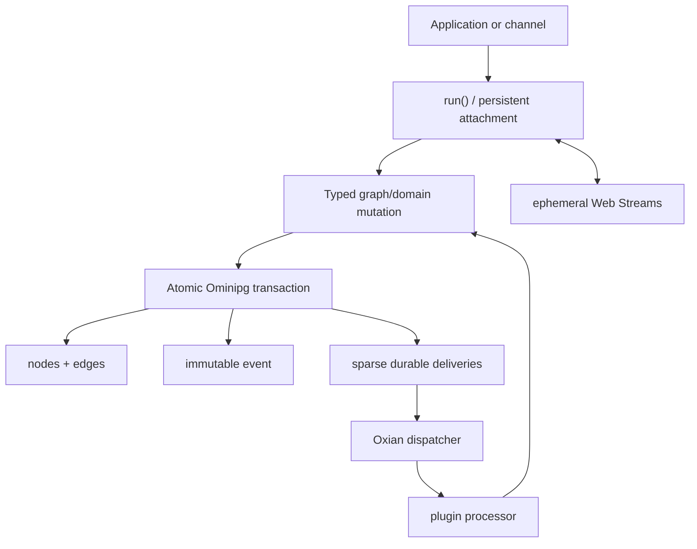

# Architecture

Copilotz separates durable meaning from execution placement.

## Domain model

A conversation is a thread plus participant graph. Messages, LLM attempts, tool
executions, assets, memories, knowledge records, schedules, and custom
collections are graph nodes with typed edges. Thread activity and ordering are
updated transactionally; there is no separate thread table.

## Event model

A durable event is an immutable fact with a ULID and database-assigned monotonic
position. An envelope is simply an event carrying routing, visibility,
causation, correlation, and subject metadata. Ephemeral deltas share the event
vocabulary but have no database ID or position.

Recipients are not persisted as work merely because they can observe an event.
Only matched durable processors create delivery rows. UI listeners, public
participants, channel observers, and raw media frames do not multiply database
work.

## Execution model

Oxian dispatches logical workload identities. Copilotz dispatch payloads contain
delivery/resource IDs, never serialized closures or physical worker identity.
The default application binds Copilotz Workers to a private Hypervisor with one
uniquely addressed in-process event-fabric transport. An embedding app may
inject a shared Hypervisor together with the same plain transport declaration
used by its Workers, or a dispatcher/target whose Workers are already hosted
elsewhere.

## Plugin model

Everything extensible is a plugin resource: agents, tools, processors,
collections, providers, channels, skills, memory, APIs, MCP servers, features,
and storage capabilities. Composition is deterministic:

1. built-in core plugins
2. declared plugins in order
3. explicit application resources

A later resource with the same type and stable ID replaces the earlier one.
Skills remain optional plugin resources: standard directories are packed before
runtime, and their instructions/files are disclosed lazily through the plugin's
portable reader.

Availability is separate from authority. Agents receive explicit tool, agent,
and skill grants; omission means none, while `{ all: true }` is the deliberate
broad-access form. `ask` and skill disclosure tools are derived implementation
mechanisms of higher-level grants. Application introspection resolves the same
catalog used by prompts and durable execution.

## Stream model

Text and realtime share the attachment boundary. Discrete input becomes a
semantic event; raw audio or future media enters once as a Web `ReadableStream`.
Backpressure remains end-to-end through Oxian. Only stream lifecycle facts and
final semantic outcomes are persisted.

## Factory-first boundary

Public runtime objects are frozen records returned by factories. Stateful
behavior is held in closures. Narrow `Error` subclasses may exist for error
identity, but managers/stores/services are not public architecture classes.

For implementation-level detail, see [the v3 design index](v3/README.md).
