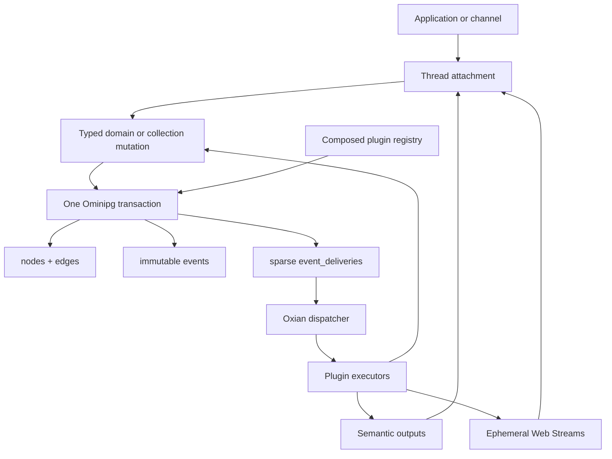

# Architecture

Copilotz separates durable domain truth, causal work, and transport placement.

## Boundaries

The graph is canonical application state. An event is an immutable fact about a
graph/domain operation. An envelope is simply an event with routing metadata; it
has no separate table or lifecycle. A delivery is mutable guaranteed-work state
for one stable logical consumer.

Recipient selection and worker placement are intentionally separate:

1. The plugin registry evaluates synchronous durable processor filters.
2. The graph mutation, event, and matching delivery obligations commit
   atomically.
3. Copilotz publishes the event and asks Oxian to dispatch each delivery
   immediately.
4. If dispatch is interrupted, the database obligation remains recoverable.

Participants, UIs, channel observers, and media listeners do not create delivery
rows. Database growth follows semantic facts and actionable consumers rather
than team size or frame rate.

## Text and realtime

Text and realtime share the attachment boundary. Discrete input becomes a
durable semantic event. A media input crosses Oxian as a backpressured byte
stream; only lifecycle, transcript, final-message, tool, interruption, and error
facts become durable events.

Concurrent speaking is not serialized into a single-speaker lock. Each output
stream carries its participant identity, media type, stream ID, and causal
scope.

## Runtime neutrality

The package core depends on Web APIs, Oxian, and Ominipg. Filesystem plugin
loading and HTTP serving are adapters. A default engine creates a private
in-process host; embedded applications can inject a shared host or hypervisor
dispatcher.
