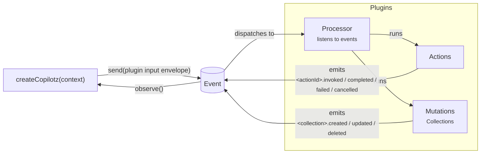

# Architecture

Copilotz separates durable meaning from execution placement. The north-star loop
is: applications send plugin-owned input envelopes, runtime persists and
dispatches Events, plugin Processors react, and plugin-owned Actions or
Collections emit more Events.



Important boundaries:

- `copilotz.send(...)` is runtime-neutral application ingress. It does not
  invoke a plugin Action directly or promote plugin APIs onto the application
  object.
- Plugins may export typed helpers that build input envelopes, such as
  `core.message(...)`; runtime persists those envelopes opaquely.
- Inside Processors and Actions, business operations use direct aliases such as
  `context.actions.generate(...)` and `context.collections.message.create(...)`.
- Action lifecycle Event Bodies contain the invocation input and the terminal
  output or error. Processors receive that resolved data directly; there is no
  separate Action invocation or query API.

## Domain model

A conversation is a thread plus participant graph. Messages, assets, memories,
knowledge records, schedules, and custom collections are graph nodes with typed
edges. Thread activity and ordering are updated transactionally; there is no
separate thread table.

LLM generations, sessions, and tool executions are durable Actions, not semantic
graph nodes. Their persisted lifecycle events are self-contained and can drive
later Processors directly. Internal provider retries remain accounting inside
the LLM Action output unless a plugin deliberately declares a separate provider
Action. Messages remain graph records because they are the canonical transcript
used to reconstruct a thread or conversation.

## Event model

A durable event is an immutable fact with a ULID and database-assigned monotonic
position. An envelope is simply an event carrying routing, visibility,
causation, correlation, and subject metadata. Ephemeral deltas share the event
vocabulary but have no database ID or position.

Collection mutations emit events derived from the Collection name, such as
`message.created`. Executable work emits lifecycle events derived from the
Action identity, such as `llm.generate.invoked`, `tool.call.completed`, and
`tool.call.failed`. Both use the same durable event and delivery backbone.

Recipients are not persisted as work merely because they can observe an event.
Only matched durable processors create delivery rows. UI listeners, public
participants, channel observers, and raw media frames do not multiply database
work.

## Execution model

Oxian dispatches logical workload identities. Copilotz dispatch payloads contain
delivery/resource IDs, never serialized closures or physical worker identity.
The default `createCopilotz()` application composes a private Gateway and Worker
over one uniquely addressed in-process event-fabric transport. Explicit
topologies use `createCopilotzGateway()` and `createCopilotzWorker()` with the
same plain transport vocabulary:

```text
embedded      Gateway ── in-process fabric ── Worker
split-local   Gateway ── in-process fabric ── Worker(s)
remote        Gateway ── WebSocket ────────── Worker(s)
shared-host   Gateway ── injected dispatcher ─ existing Oxian fleet
```

In-process and WebSocket paths use the same versioned Copilotz work protocol and
lifecycle. The transport adapter owns byte movement; semantic events, response
metadata, cancellation, and raw stream output follow one framing contract. Local
transport can retain byte arrays without WebSocket encoding.

## Plugin model

Everything extensible is a plugin declaration or composed value. Collections,
Actions, and Processors are executable plugin declarations. Semantic values such
as agents and tools are Resources; variable external implementations are
Adapters. Composition is deterministic:

1. dependency plugins, depth first
2. declared plugins in order
3. explicit application Resources and Adapters

A later resource with the same type and stable ID replaces the earlier one.
Skills remain optional plugin resources: standard directories are packed before
runtime, and their instructions/files are disclosed lazily through the plugin's
portable reader.

Availability is separate from authority. Agents receive explicit tool, agent,
and skill grants; omission means none, while `{ all: true }` is the deliberate
broad-access form. `ask` and skill disclosure tools are derived implementation
mechanisms of higher-level grants. Application introspection resolves the same
catalog used by prompts and durable execution.

## Stream model

Text and realtime share the attachment boundary. Discrete input becomes a
semantic event; raw audio or future media enters once as a Web `ReadableStream`.
Backpressure remains end-to-end through Oxian. Only stream lifecycle facts and
final semantic outcomes are persisted.

## Factory-first boundary

Public runtime objects are frozen records returned by factories. Stateful
behavior is held in closures. Narrow `Error` subclasses may exist for error
identity, but managers/stores/services are not public architecture classes.

The public application boundary intentionally omits the internal engine and
worker workload closures. Application code selects a role and declares its
transport, lifecycle functions, plugins, and persistence. Copilotz owns the
assembly details.

For implementation-level detail, see [the v3 design index](v3/README.md).
