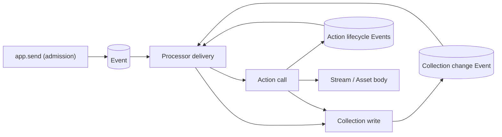

# Architecture

## The pain

A Notes request looks simple: accept some text, validate it, store a note. Then
the process stops after the note is written but before the reply is sent. The
client retries. A support engineer wants to know whether the save happened. A
second team wants to reuse the same save logic from a schedule, an HTTP route
and an agent tool. Each of those callers ends up guessing which code owns the
note, whether a retry is safe, and where the history of one request lives.

## The problem

An application needs one contract that answers, for every piece of work:

- **ownership** — which package declares the state and the operations that may
  change it, and which host chooses the tenant, database and credentials;
- **admission** — when an input becomes a durable fact, and how a resent input
  finds the original instead of starting again;
- **settlement** — which reactions belong to that input, and when the whole
  piece of work has completed, failed or been cancelled;
- **observation** — how a caller watches progress, or replays it later, without
  changing the outcome.

Without that contract, retries duplicate writes, observers accidentally cancel
work, and reusable code quietly depends on one host's environment.

## The solution

Copilotz records work as a chain of durable facts and keeps three kinds of
ownership apart.


```mermaid
flowchart LR
  send["app.send (admission)"] --> event[("Event")]
  event --> delivery["Processor delivery"]
  delivery --> action["Action call"]
  delivery --> collection["Collection write"]
  action --> collection
  action --> lifecycle[("Action lifecycle Events")]
  collection --> change[("Collection change Event")]
  action --> stream["Stream / Asset body"]
  lifecycle --> delivery
  change --> delivery
```

### The durable path

1. **Admission.** `app.send` stores the input as an immutable Event and starts
   an **operation**. A `deduplicationId` lets a client resend the complete same
   input, including its `correlationId`, and receive the original operation.
2. **Delivery.** Each Processor whose filter matches a durable Event gets a
   recorded delivery. Delivery is at least once: an eligible pending or
   retryable delivery, or one whose lease expired, may be reclaimed and run
   again. Cancelled, dead-lettered and terminally settled work is not rerun
   automatically. Under the default `inherit` settlement its work belongs to the
   same operation; a Processor that declares detached settlement records
   background work that does not hold the operation open.
3. **Mutation.** A Processor changes state only through Actions and Collection
   writes. An Action records `<actionId>.invoked`, then `completed`, `failed` or
   `cancelled`. A Collection write commits the record, its change Event and the
   deliveries that Event matches together. Stable **operation keys** name each
   Action call and write inside a delivery, so a repeated delivery receives the
   recorded result rather than writing twice. Calls to outside services need
   their own idempotency key.
4. **Bodies.** Large or binary values become immutable Assets referenced from
   records. A progressive **Stream** is a generic byte body: readers follow its
   bytes while it is open, and an Action or Collection adopts the sealed content
   as the canonical value. Streams carry no thread, participant or visibility
   meaning of their own.

### Who owns what

| Owner                  | Owns                                                                                                                                      | Example in Notes                                         |
| ---------------------- | ----------------------------------------------------------------------------------------------------------------------------------------- | -------------------------------------------------------- |
| **Plugin definitions** | Stable IDs and contracts: Collections, Actions, Processors, Resources, Adapters. Pure modules with no environment reads or I/O on import. | `notes-plugin.ts`: `note`, `notes.save`, `notes.capture` |
| **Host composition**   | Namespace, database, credentials, live integrations, which plugins compose.                                                               | `composition.ts`: `team-notes`, `file://./data`          |
| **Runtime**            | Persistence, deliveries, leases and recovery, operation settlement, Action lifecycle, content adoption, execution transport.              | Created by `createCopilotz`                              |

The runtime never imports a concrete plugin. The agent harness under
`@copilotz/copilotz/core` is a set of plugins on top of the same primitives:
threads and messages are Collections, a model call is the `llm.call` Action, and
agents, connections, tools and Skills are Resources. Memory, Knowledge, Skills,
Channels, Schedules and Usage are optional plugins with the same shape.
Runtime-only applications never import `/core`.

### Admission, settlement and observation

These are separate questions with separate public answers:

| Question                       | Public call                            | Meaning                                                                                                                              |
| ------------------------------ | -------------------------------------- | ------------------------------------------------------------------------------------------------------------------------------------ |
| Was the input accepted?        | `await app.send(input)`                | Resolves once the Event is durable; returns `operationId`, `outputs` and `done`.                                                     |
| Did this send succeed?         | `handle.done`                          | Resolves when the operation completes; rejects when it fails.                                                                        |
| What state is it in now?       | `app.operationStatus({ operationId })` | Recorded state, or `null` when the namespace has no such operation.                                                                  |
| What happened, from the start? | `app.attach({ operationId })`          | Replays recorded Events, then follows. `done` resolves at **any** final state; check it.                                             |
| What is happening anywhere?    | `app.observe()`                        | Best-effort live stream for this application, independent of any operation.                                                          |
| Stop the work                  | `app.cancelOperation(...)`             | Explicitly requests cancellation of the operation's durable work. Dropping or detaching an observer is separate and cancels nothing. |

An identical resend with the same `deduplicationId` sees the live outputs of the
original operation; `attach` replays its recorded history. Closing the
application stops its local readers and workers; it does not cancel recorded
work, which a later application on the same database can resume.

Raw in-process streams are not an end-user authorization boundary: they can
include data that a semantic plugin treats as private. An authorized server must
filter or redact by ownership and visibility _before_ transmitting anything to
an end user; hiding data in a UI after the bytes arrive does not protect it. See
[Agent capabilities](agent-capabilities.md) and Chapters
[16](getting-started/part-4-release-to-users/16-authenticate-and-isolate-tenants.md)
and
[17](getting-started/part-4-release-to-users/17-connect-chat-and-channels.md)
for semantic views.

### One worked example

`architecture.ts` reuses `notes-plugin.ts` and `composition.ts` exactly as
[Chapter 7](getting-started/part-2-verify-and-recover/07-persist-and-recover.md)
leaves them, with `@copilotz/copilotz@^0.86.1` installed. It admits one input
twice with the same identity, then replays the operation.

```ts
// Runtime factory and the guard that separates byte streams from Events.
import { createCopilotz, isStreamOutput } from "@copilotz/copilotz";
// Type of each output a send handle or attachment yields.
import type { ApplicationOutput } from "@copilotz/copilotz";
// Host choices: tenant namespace, persistent database and composed plugins.
import { database, namespace, runtimePlugins } from "./composition.ts";

// Prints Event types and releases any byte stream so it cannot hold a reader.
async function printTypes(
  label: string,
  outputs: ReadableStream<ApplicationOutput>,
): Promise<void> {
  for await (const output of outputs) {
    if (isStreamOutput(output)) {
      await output.payload.cancel();
      continue;
    }
    console.log(`${label} ${output.durable ? "event" : "live"} ${output.type}`);
  }
}

const app = await createCopilotz({
  namespace,
  database,
  plugins: runtimePlugins,
});

try {
  // One complete input. Resending it unchanged, with the same correlation and
  // deduplication IDs, must return the original operation.
  const input = {
    type: "notes.capture.requested",
    payload: { text: "Review the architecture page." },
    correlationId: "architecture-demo",
    deduplicationId: "architecture-demo-1",
  };

  // Admission and settlement: `done` rejects if the operation fails.
  const first = await app.send(input);
  const [firstDrained, firstSettled] = await Promise.allSettled([
    printTypes("first", first.outputs),
    first.done,
  ]);
  if (firstDrained.status === "rejected") throw firstDrained.reason;
  if (firstSettled.status === "rejected") throw firstSettled.reason;

  // A retried admission: same operation, no second note.
  const retry = await app.send(input);
  const [retryDrained, retrySettled] = await Promise.allSettled([
    printTypes("retry", retry.outputs),
    retry.done,
  ]);
  if (retryDrained.status === "rejected") throw retryDrained.reason;
  if (retrySettled.status === "rejected") throw retrySettled.reason;
  console.log(`same operation: ${retry.operationId === first.operationId}`);

  // Observation after the fact: replay records nothing and reruns nothing.
  const attachment = await app.attach({ operationId: first.operationId });
  const [replayDrained, replaySettled] = await Promise.allSettled([
    printTypes("replay", attachment.outputs),
    attachment.done,
  ]);
  if (replayDrained.status === "rejected") throw replayDrained.reason;
  if (replaySettled.status === "rejected") throw replaySettled.reason;

  // `attach.done` resolves at any final state, so confirm the recorded one.
  const status = await app.operationStatus({ operationId: first.operationId });
  console.log(`operation ${status?.state ?? "unknown"}`);
} finally {
  // Release the database, including after a failure.
  await app.close();
}
```

Run it with `deno run -A architecture.ts` or `node architecture.ts`. Expect
`same operation: true`, a replay that includes `notes.capture.requested`,
`note.created` and `notes.save.completed`, ending with the live
`operation.completed`, and `operation completed`. Running the script a second
time against the same `./data` directory reuses the same deduplicated operation.

### Placement

`createCopilotz` runs embedded by default. The same plugins can run split into a
gateway that admits and serves `fetch`, and workers that execute deliveries,
sharing one persistence. Placement changes processes and transport, never plugin
IDs or contracts;
[Deploy and Scale](getting-started/part-5-operate-and-scale/21-deploy-and-scale.md)
covers roles.

## What this unlocks

- Reuse one plugin from scripts, tests, HTTP, schedules and agents, because
  definitions hold no host choices.
- Retry admissions and recover crashed deliveries without duplicate writes.
- Answer "what happened to this request?" from one operation ID.
- Add the agent harness or other semantic plugins without changing the runtime
  contract underneath.
- Move from one process to gateway and workers without rewriting plugins.

## Next steps

- [Events, Deliveries and Recovery](events-deliveries-recovery.md): delivery,
  lease and settlement details.
- [Plugins and Processors](plugins-and-processors.md): composition, dependencies
  and settlement modes.
- [Content and Assets](content-assets.md) and [Streams](streams.md): large and
  progressive bodies.
- [API Reference](api.md): every application method and option.
